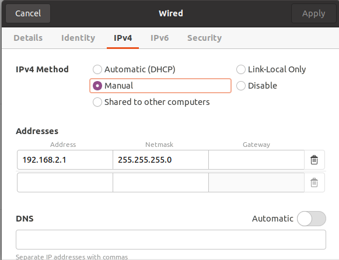
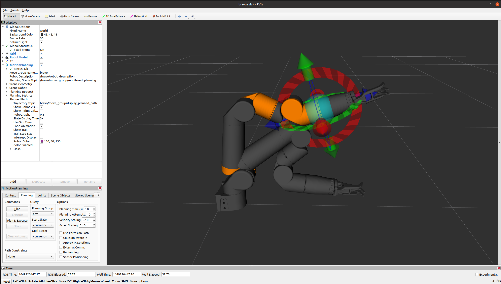

# bravo_arm_sw

Launch files for the Blueprint Labs Bravo. First stop for installing software.

# Installation
This repo lists various Bravo arm driver dependencies in `bravo_arm_sw.repos`. To install them, we use the `vcstool` version control tool and `rosdep`. This repository assumes that you have ROS Noetic installed (though other distributions may also work). If you have not installed ROS, follow [the official instructions](http://wiki.ros.org/noetic/Installation/Ubuntu), including the step "Dependencies for building packages".

If you do not have `vcstool`, install it. Assuming your apt list already contains the ROS repositories:
```
sudo apt-get update
sudo apt-get install python3-vcstool
```

Then, `vcstool` can automatically clone the dependencies for you. Clone this repository into a catkin workspace, then download the depenendencies as shown:
```
mkdir -p catkin_ws/src
cd catkin_ws/src
git clone https://gitlab.com/rsa-manipulation-testbed/bravo_arm_sw
cd ..
vcs import < src/bravo_arm_sw/bravo_arm_sw.repos
```

In the resulting directory structure, `catkin_ws/src/` will include this `bravo_arm_sw` repo as well as the additional repositories listed in the `.repos` file.

After cloning the dependencies, use `rosdep` to install the apt-installable dependencies listed within each package's `package.xml`:
```
rosdep install --from-paths src --ignore-src -r -y
```

Then you can build the packages:
```
# sudo apt-get install python3-catkin-tools # if you can not `catkin build`
catkin build
```

# Connecting to the Arm

To connect to the arm, you need to connect to the arm with an ethernet cable and set the host computer's IPv4 information. The arm expects the following configuration:

| Item                      | Value             |
| -----------               | -----------       |
| Subnet Mask               | 255.255.255.0     |
| Host computer IP          | 192.168.2.1       |
| Arm computer IP and port  | 192.168.2.3:6789  |

If you have multiple network interfaces (e.g., WiFi and a LAN port), then you may need to disable the other interface if the IP range interferes with the common 192.168 block.

An example Ubuntu configuration is below.



With the network set up, you should be able to reach the arm with:
```
ping 192.168.2.3
```
> **Note**
>
> Need to connect to WiFi at the same time? Don't quote me on this, but you might be able to specify "link-local" connection in the IPv4 settings for the ethernet table, and then explicitly add a route to the arm with `sudo route add 192.168.2.3 dev enp3s0`, where `enp3s0` is the Linux network device corresponding to to ethernet visible in the output of `ip addr`. This seems brittle though since it resets when you disconnect from the arm.

# Using the Arm Software

To bring up a graphical interface to control the arm, first source your workspace and then use:
```
roslaunch bravo_arm_sw bravo_driver.launch simulated:=false
```

This brings up an RViz interface similar to the figure below.



## Enabling the Arm
To arm the arm, we use our patented arm-arming service. This service enables the "write" commands within `rsa_bravo_driver` that set joint positions and cause motion. **The arm motion should only be enabled when people are clear of the workspace.**

From a terminal in which you have sourced the workspace, run:
```
rosservice call /bravo/enable_bravo 1
```

If you ever wish to disable arm motion, issue:
```
rosservice call /bravo/enable_bravo 0
```
which will prevent subsequent joint positions from being commanded.

## Simulation
A configuration is also provided to simulate arm motions in Gazebo. To launch in simulation, use the `simulated` flag (enabled by default):
```
roslaunch bravo_arm_sw bravo_arm.launch simulated:=true
```
This launches the same Rviz window as with `simulated:=false`, but starts a Gazebo server to simulate the arm in an empty world.

## Motion Planning
You can perform motion planning by dragging the interactive in marker, clicking '**plan**', inspecting the animated trajectory to verify that it is free of collisions, and clicking '**execute**'.

> **Warning!**
>
> Inspect every planned trajectory to verify that it is collision free before executing. By default there are **no obstacles** registered in the motion planning scene. Therefore, trajectories may be planned that intersect the table or other obstacles.

## Velocity Control with Game Controller
You can control the arm using a game controller to direct the linear and angular velocity of the end effector. If you wish to do so, plug in an Xbox controller and ensure that the `use_controller` argument to `bravo_driver.launch` (enabled by default) is `true`:
```
roslaunch bravo_arm_sw bravo_driver.launch use_controller:=true
```

The controls are given in `bpl_bravo_moveit_config/config/xbox_controller.yaml`. If you have a different type controller, you should create a different configuration.